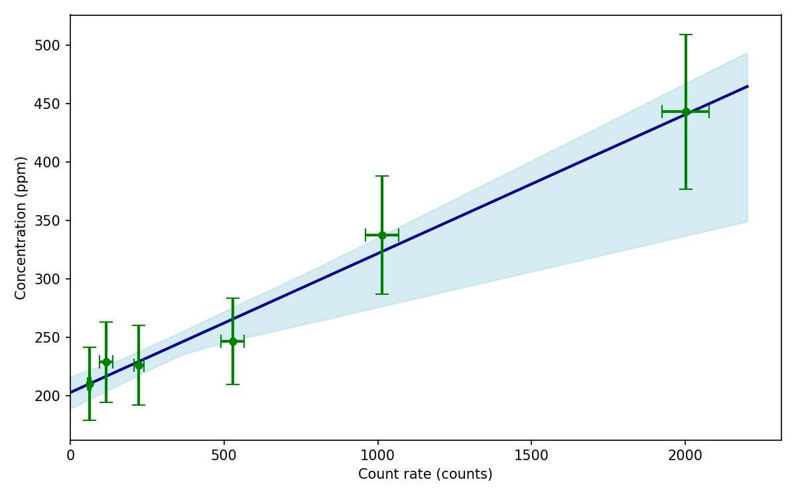

# ODR Bootstrap

[](https://github.com/whtowbin/odr_bootstrap_package/actions/workflows/tests.yml)
[](https://pypi.org/project/odr-bootstrap/)
[](https://www.python.org/downloads/release/python-3110/)
[](https://opensource.org/licenses/MIT)

Orthogonal Distance Regression with Bootstrap Resampling for SIMS Calibration

A Python package for robust calibration curve fitting with proper uncertainty quantification in both x and y measurements.

## Overview

**What is ODR Bootstrap?**

When fitting calibration curves to scientific data, measurement errors exist in both the independent variable (x, e.g., concentration) and dependent variable (y, e.g., ion intensity). Ordinary least squares regression assumes errors only in y, leading to biased fits. 

**Orthogonal Distance Regression (ODR)** properly accounts for uncertainties in both x and y. **Bootstrap resampling** estimates confidence intervals by repeatedly refitting the model to random subsamples of the calibration data.

This package combines these techniques for publication-ready uncertainty quantification in SIMS (Secondary Ion Mass Spectrometry) calibration analysis. It is broadly applicable to other types of analytical calibrations and uses of linear regressions. 


## Installation

### With UV (recommended)

```bash
uv pip install odr-bootstrap
```

### With pip

```bash
pip install odr-bootstrap
```

### From source

```bash
git clone https://github.com/whtowbin/odr_bootstrap_package.git
cd odr_bootstrap_package
uv sync
# or
pip install -e .
```

## Documentation

Full documentation is available at [Read the Docs](https://odr-bootstrap.readthedocs.io).

For quick reference, see:
- [API Reference](https://odr-bootstrap.readthedocs.io/en/latest/api.html)
- [Tutorial & Examples](https://odr-bootstrap.readthedocs.io/en/latest/tutorial.html)
- [Examples Directory](./examples)

## Quick Start

```python
import numpy as np
import matplotlib.pyplot as plt
from odr_bootstrap import ODR_Bootstrap, plot_regression

# Prepare calibration data
x_standards = np.array([0.1, 0.5, 1.0, 2.0, 5.0])      # Concentrations
y_intensity = np.array([45, 200, 350, 700, 1450])      # Ion counts
x_uncertainty = np.array([0.01, 0.05, 0.1, 0.2, 0.5]) # Measurement errors in x
y_uncertainty = np.array([5, 20, 35, 60, 120])         # Measurement errors in y

# Run ODR bootstrap with 2000 resamples
confidence_data, best_fit_params, points, all_params, subsamples = ODR_Bootstrap(
    x=x_standards,
    y=y_intensity,
    x_err=x_uncertainty,
    y_err=y_uncertainty,
    resample_draws=2000,
    InterceptFit=True,
    InitialGuess=[250, 10],
    Confidence_Bound=0.95,
    LineMax=6,
)

# Plot the result
fig, ax = plt.subplots(figsize=(8, 5))
plot_regression(
    confidence_data,
    datapoints=points,
    ax=ax,
    ecolor='lightblue',
    line_color='darkblue',
    linewidth=2,
)
ax.set_xlabel('Concentration (ppm)')
ax.set_ylabel('Ion Intensity (counts)')
ax.set_title('SIMS Calibration Curve with 95% Bootstrap CI')
plt.tight_layout()
plt.savefig('calibration_curve.png', dpi=150)
plt.show()

# Access results
print(f"Slope: {best_fit_params[0]:.2f}")
print(f"Intercept: {best_fit_params[1]:.2f}")
```

### Plotting Calibration Estimate Distributions

```python
from odr_bootstrap import plot_Calibration_Estimates
import numpy as np

# Extract bootstrap parameter distributions
all_slopes = np.array([p[0] for p in all_params])
all_intercepts = np.array([p[1] for p in all_params])

# Create synthetic measurement ensemble (for visualization)
fit_params = np.array([[all_slopes.mean(), all_intercepts.mean()]] * 5)
fit_params += np.random.normal(0, [all_slopes.std(), all_intercepts.std()], (5, 2))
fit_error = np.array([[all_slopes.std(), all_intercepts.std()]] * 5)

# Generate plot
fig = plot_Calibration_Estimates(
    fit_params,
    fit_error,
    Title="Calibration Slope & Intercept Distributions",
)
plt.savefig('calibration_estimates.png', dpi=150)
plt.show()
```

## Example Output

The example script produces two useful figures for calibration analysis:

### Calibration curve with bootstrap confidence band



This plot shows the fitted calibration line and the shaded bootstrap uncertainty region. It is useful for publication figures and for checking whether the model tracks the data well across the full concentration range.

### Bootstrap parameter distributions


This plot summarizes the distribution of the fitted slope and intercept across bootstrap resamples. It helps communicate how stable the calibration parameters are and how much uncertainty is associated with the estimated fit.

## Module Functions

### Core Fitting

- **`ODR_Linear(x, y, x_err, y_err, intercept=False, InitialGuess=[100, 1])`**  
  Single orthogonal distance regression fit with optional y-intercept.
  Returns: (fitted_params, param_uncertainties)

- **`ODR_Linear_Test(x, y, x_err, y_err, ...)`**  
  ODR fit returning full scipy.odr output object for diagnostics.

- **`Bootstrap_fit(x, y, x_err, y_err, resample_draws, ...)`**  
  Resample data N times and fit ODR model to each resample.
  Returns: (all_fit_params, resampled_data)

### Confidence Intervals

- **`Eval_Conf(Fit_Param, Confidence_Bound=0.95, LineMax=200, ...)`**  
  Compute confidence intervals from bootstrap parameter distributions.
  Returns: DataFrame with confidence bounds indexed by x-values.

- **`ODR_Bootstrap(...)`**  
  Convenience wrapper combining Bootstrap_fit + Eval_Conf in one call.

### Statistics

- **`gauss_agv_err(concentrations, errors, ...)`**  
  Aggregate multiple normal distributions into single KDE estimate.
  Returns: (distribution_dict, statistics_dict)

### Plotting

- **`plot_regression(confidence_df, datapoints=None, ax=None, ...)`**  
  Plot best-fit line with shaded confidence band.

- **`plot_datapoints(data, bounds, ax=None, ...)`**  
  Plot probability density curve with summary statistics.

- **`plot_Calibration_Estimates(fit_params, fit_error, Title=...)`**  
  Side-by-side slope and intercept distribution plots.


## Example Workflow

See [examples/example.py](examples/example.py) for a complete working example:

```bash
cd examples
python example.py
```

This generates:
- `calibration_curve.png` - Fitted line with confidence band
- `calibration_estimates.png` - Bootstrap parameter distributions

## API Reference

Full documentation is available in function docstrings:

```python
from odr_bootstrap import ODR_Bootstrap
help(ODR_Bootstrap)
```

## Requirements

- Python >= 3.11
- numpy >= 2.2.4
- scipy >= 1.15.2
- pandas >= 2.2.3
- matplotlib >= 3.10.1

## License

MIT License - See [LICENSE](LICENSE) file for details.

## Citation

If you use this package in research, please cite:

```bibtex
@software{towbin2025odr,
  title={ODR Bootstrap: Orthogonal Distance Regression with Bootstrap Resampling},
  author={Towbin, Henry},
  year={2025},
  url={https://github.com/whtowbin/odr_bootstrap_package}
}
```


---

**Status**: Beta (0.1.0) | **Last Updated**: April 2025
