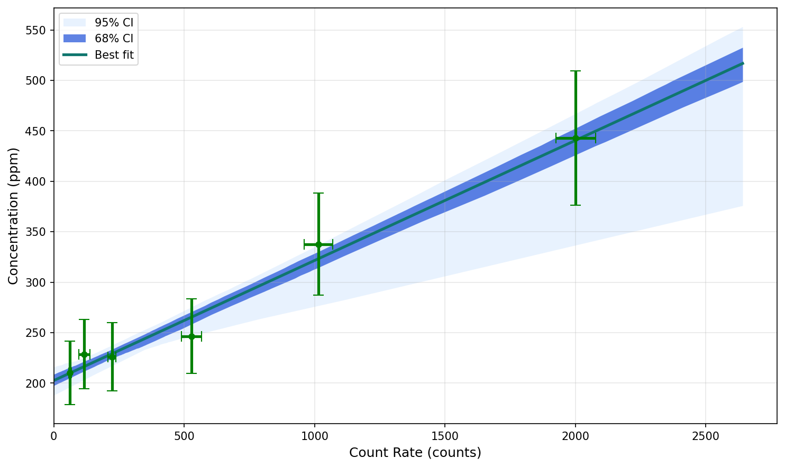
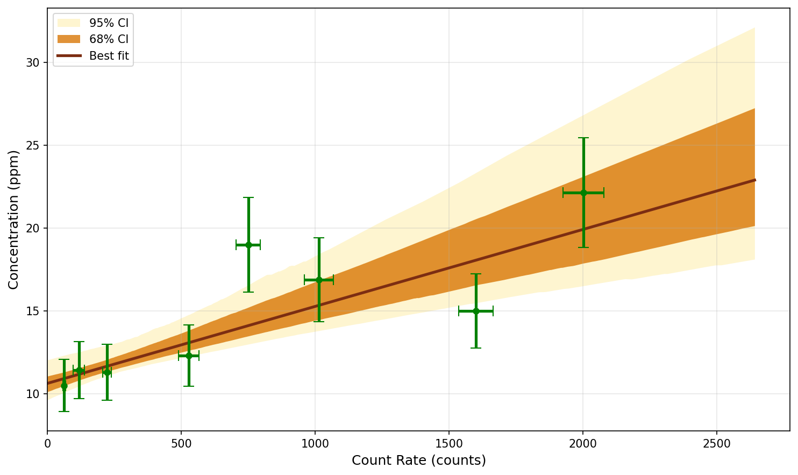
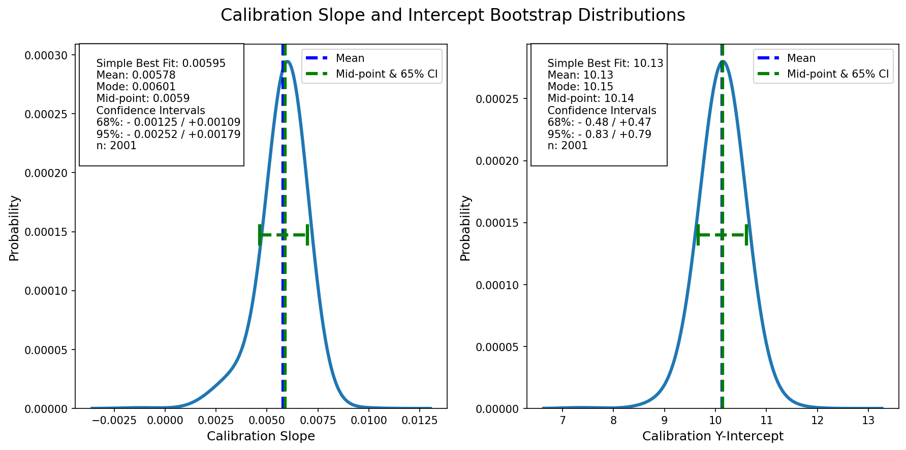
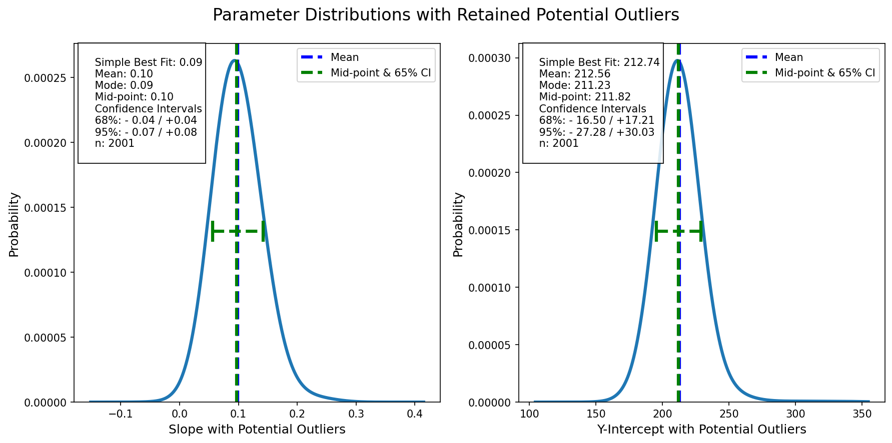

========
Examples
========

Complete Working Examples
==========================

The package includes a complete runnable example:

.. code-block:: bash

   cd examples
   python example.py

This generates:

- **calibration_curve.png** - Best-fit line with both 68% and 95% confidence bands
- **calibration_curve_outlier.png** - Synthetic outlier example with a larger anomalous point
- **calibration_estimates.png** - Bootstrap parameter distributions for the clean dataset
- **calibration_estimates_outlier.png** - Parameter distributions for the outlier-affected fit

Example Output
==============

The example writes four publication-quality figures from synthetic calibration datasets. Together they show the fitted calibration relationship, the effect of a larger outlier on the uncertainty bands, and the distribution of the fitted slope and intercept estimates for both the clean and outlier-affected models.

The first plot shows the best-fit line with both the 68% and 95% bootstrap confidence bands in one figure, the second demonstrates larger outliers and how they broaden the uncertainty envelope, and the third/fourth use the Gaussian aggregate summary from ``gaussian_aggregate`` to visualize the slope and intercept distributions for the clean and outlier-affected fits.

Calibration Fit
---------------

   The fitted regression line follows the expected linear trend while the narrower 68% band and broader 95% band capture the uncertainty estimated by bootstrap resampling.

Outlier Sensitivity
-------------------

   Larger outliers widen the uncertainty envelope and shift the fitted trend, which helps illustrate the value of robust calibration checks and careful outlier review.

Parameter Uncertainty
---------------------

   The distribution of slope and intercept estimates provides a compact view of parameter uncertainty, which is especially useful for scientific reporting.

Outlier-Affected Parameter Statistics
------------------------------------

   This companion plot shows how a larger anomalous point broadens and shifts the fitted parameter distributions. The Gaussian aggregate view makes the outlier influence explicit while keeping the same statistical summary used for the clean dataset.

What to look for in these figures
---------------------------------

- The regression fit should align closely with the measured calibration points.
- The 68% band should be narrower than the 95% band, reflecting the larger confidence range at the 95% level.
- The outlier example should show a broader uncertainty band and a larger spread in the fitted parameters.
- The parameter histograms should be centered near the best-fit slope and intercept values.
- Larger resample counts usually produce smoother, more stable distributions.

The console output is structured as follows:

.. code-block:: text

   ======================================================================
   ODR Bootstrap Calibration Example
   ======================================================================

   [1/5] Creating synthetic calibration data...
      Standards: [ 0.1  0.5  1.   2.   5.  10. ]
      Measurements: [  22.13  9.94  145.01  246.72  596.80  1266.14]
      X uncertainties: [0.01 0.05  0.1  0.2  0.5  1. ]
      Y uncertainties: [ 20  30  50  60 100 150]

   [2/5] Running ODR Bootstrap (N=2000 resamples)...
      Best fit slope: 122.91
      Best fit intercept: -5.20
      Bootstrap resamples computed: 2000
      Data points after NaN removal: 6

   [3/5] Plotting regression with 68% and 95% confidence intervals...
      ✓ Saved: calibration_curve.png

   [4/5] Plotting outlier sensitivity example...
      ✓ Saved: calibration_curve_outlier.png

   [5/6] Plotting calibration estimate distributions...
      ✓ Saved: calibration_estimates.png

   [6/6] Plotting outlier-affected calibration estimate distributions...
      ✓ Saved: calibration_estimates_outlier.png

Source Code
===========

The example demonstrates:

1. **Computing defaults** with ``fit_defaults`` to derive ``initial_guess``, ``line_max``, and ``line_interval`` from the data
2. **Running ODR bootstrap** with proper error propagation
3. **Plotting results** with publication-quality figures
4. **Extracting statistics** from bootstrap distributions
5. **Comparing clean and outlier-affected parameter distributions**

See ``examples/example.py`` in the source repository or browse online:

.. code-block:: text

   https://github.com/whtowbin/odr_bootstrap_package/blob/main/examples/example.py

Adapting for Your Data
======================

To use ODR Bootstrap with your own data:

1. **Prepare your data**

   .. code-block:: python

      import numpy as np
      from odr_bootstrap import odr_bootstrap, fit_defaults, plot_regression

      x_standards = np.array([...])
      y_measured = np.array([...])
      x_uncertainty = np.array([...])
      y_uncertainty = np.array([...])

2. **Derive fitting defaults from your data**

   .. code-block:: python

      defaults = fit_defaults(x_standards, y_measured)

3. **Run the fit**

   .. code-block:: python

      confidence_data, params, points, all_params, _ = odr_bootstrap(
          x=x_standards,
          y=y_measured,
          x_err=x_uncertainty,
          y_err=y_uncertainty,
          resample_draws=5000,
          fit_intercept=True,
          initial_guess=defaults["initial_guess"],
          line_max=defaults["line_max"],
          line_interval=defaults["line_interval"],
          confidence_level=0.95,
      )

4. **Visualize and analyze**

   .. code-block:: python

      import matplotlib.pyplot as plt

      fig, ax = plt.subplots(figsize=(10, 6))
      plot_regression(confidence_data, datapoints=points, ax=ax)
      ax.set_xlabel('Concentration')
      ax.set_ylabel('Measured Signal')
      plt.savefig('my_calibration.png')
      plt.show()

      slope, intercept = params
      print(f"y = {slope:.2f}*x + {intercept:.2f}")

Troubleshooting
===============

**Problem: Poor fit quality**

- Check for outliers in your data
- Verify uncertainty estimates are realistic
- Call ``fit_defaults(x, y)`` to inspect the least-squares initial guess and confirm it is reasonable for your data range
- Increase ``resample_draws`` for better bootstrap estimates

**Problem: Slow execution**

- Decrease ``resample_draws`` for testing
- Increase ``line_interval`` to reduce the confidence-interval grid resolution
- Consider reducing data size or excluding low-quality measurements

**Problem: NaN or Inf in results**

- Check input data for NaN or Inf values
- Verify uncertainty values are positive
- Ensure you have at least 3 data points for intercept fit, 2 for zero-intercept

More Help
=========

- :doc:`tutorial` for detailed explanations
- :doc:`api` for function reference
- `GitHub Issues <https://github.com/whtowbin/odr_bootstrap_package/issues>`_ for bugs or questions
